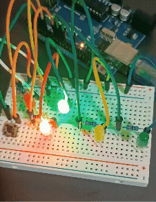
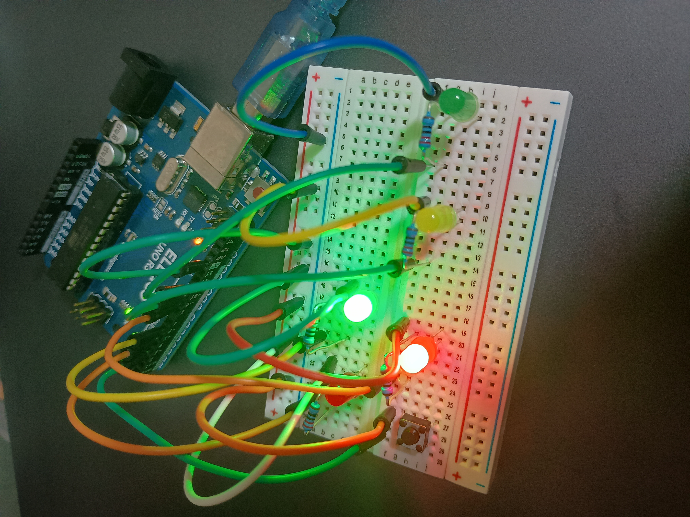
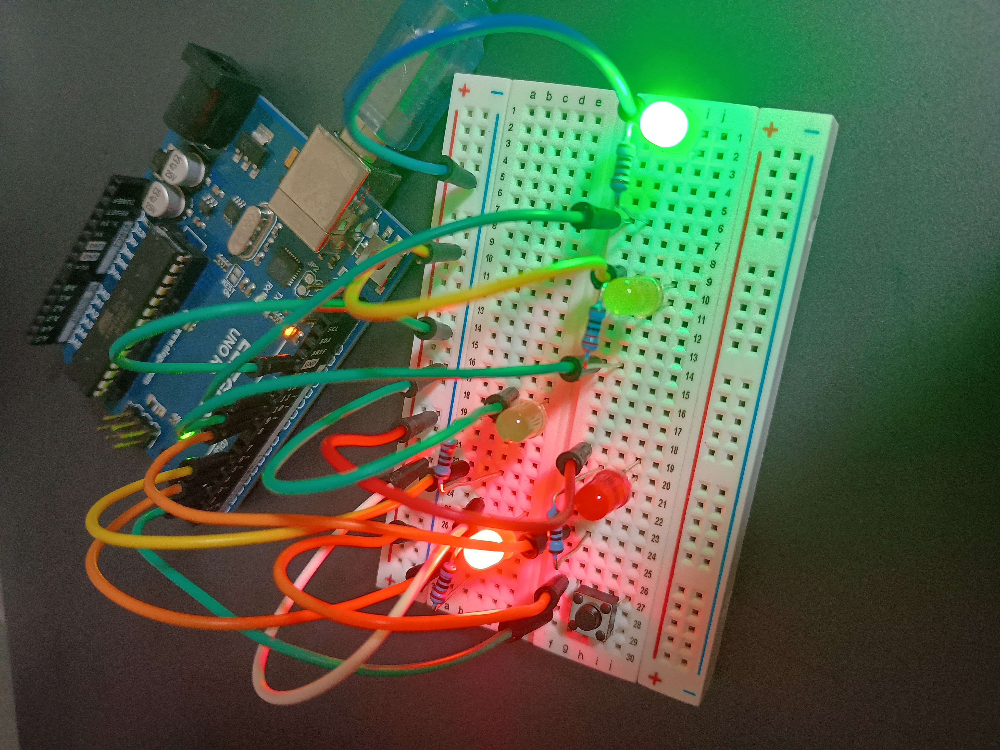
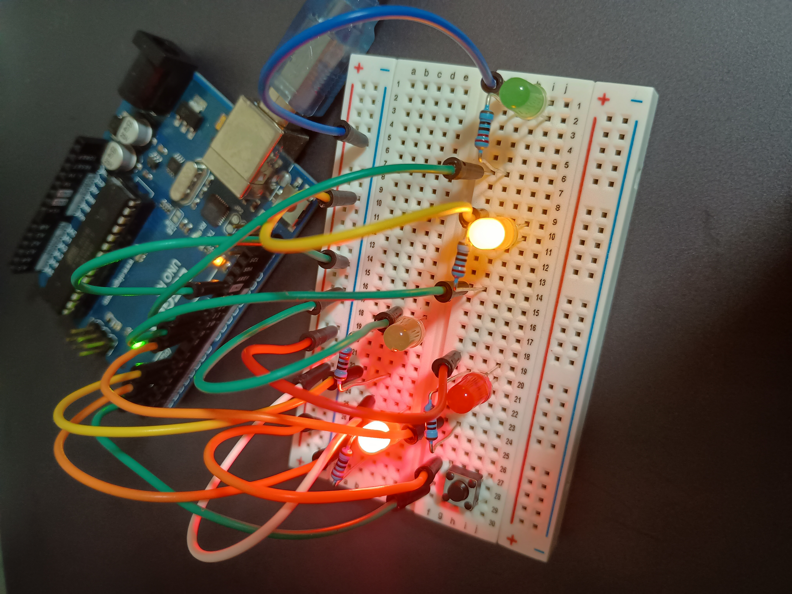

# 歩行者信号付き信号機制御システム

## デモ


---

## 概要
Arduinoを用いて、車両用信号（赤・黄・緑）と歩行者用信号（赤・青）を制御するシステムを実装した。

時間による自動制御に加え、歩行者ボタンの入力によって信号状態を変化させることで、
実際の交通信号に近い挙動を再現している。

---

## 動作





### 車両用信号
通常時は以下の順で信号が切り替わる：

- 赤（5秒）
- 緑（5秒）
- 黄（2秒）
- → 繰り返し

### 歩行者用信号
- 車両が赤のとき → 歩行者は青（通行可能）
- 車両が緑・黄のとき → 歩行者は赤（待機）

### 歩行者ボタン
- 緑信号中にボタンを押すと、即座に黄信号へ遷移
- その後、通常通り赤信号へ移行

※ 「緑 → 黄 → 赤」の自然な流れを維持

---

## 使用技術

- デジタル入出力制御
- millis()による時間管理（ノンブロッキング処理）
- 状態遷移（ステートマシン）
- エッジ検出（ボタン入力）

---

## 設計のポイント

### ① 状態遷移による制御
各信号を状態として管理し、switch文で処理を分岐することで、
拡張性と可読性の高い構造を実現した。

---

### ② millisによる非同期処理
delay()を使用せず、millis()で時間を管理することで、
ボタン入力などのイベントをリアルタイムに処理可能にした。

---

### ③ ボタンのエッジ検出
```cpp
if (lastButtonState == HIGH && currentButton == LOW)
```
---

###  使用部品

- ELEGOO Uno R3
- LED ×5
- 車両用：赤・黄・緑
- 歩行者用：赤・青
- 抵抗（220Ω程度）×5
- タクトスイッチ ×1
- ブレッドボード
- ジャンパーワイヤ
---

##  改善・発展案

- 歩行者用信号（青・赤LED）の追加
- 夜間モード（点滅制御）
- センサ（明るさ・人感）との連携
- 状態遷移のクラス化

---

##  学び

本プロジェクトを通して、以下を学習した：

- 状態遷移を用いたプログラム設計
- 非同期処理（millis）の重要性
- 入力と出力を組み合わせた制御
- 実際の仕様を意識したロジック設計

---
