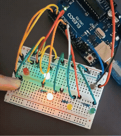
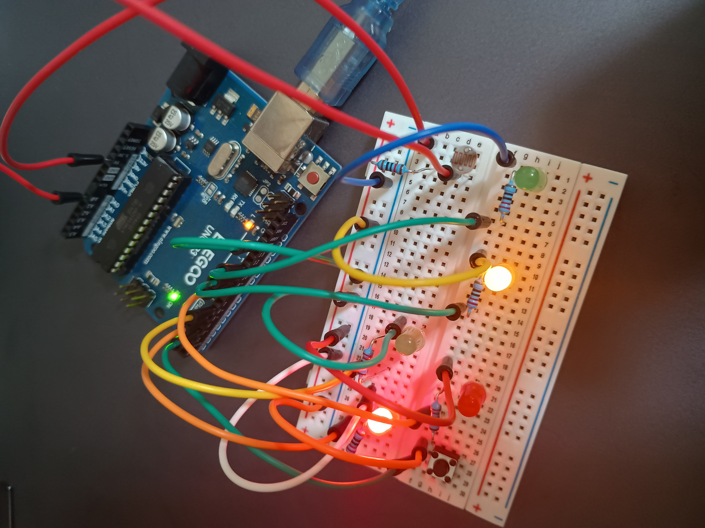
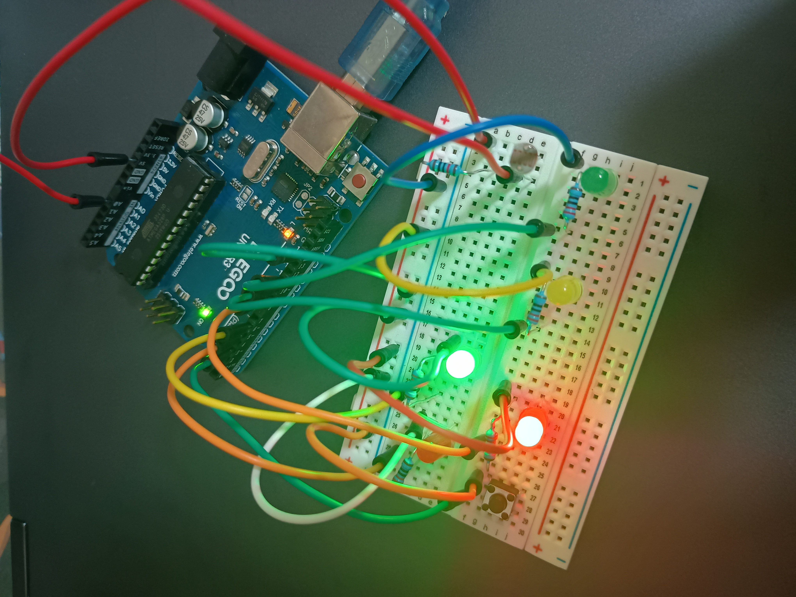

#  光量自動調整付き 歩行者信号システム

## デモ

### 光量自動調整（しきい値制御）

明るい環境 → LEDがほぼ消灯  
暗い環境 → LEDが最大発光  

---

### 歩行者ボタン

ボタン押下で信号状態が遷移  

---
---

## 概要
Arduinoを用いて、車両用信号（赤・黄・緑）と歩行者用信号（赤・青）を連動させた制御システムを実装した。

さらに、フォトレジスタによる周囲の明るさ取得とPWM制御を組み合わせることで、
環境に応じてLEDの光量を自動調整する機能を追加している。

---

## 動作

###  車両用信号
- 🔴 赤（停止）
- 🟢 緑（進行）
- 🟡 黄（注意）
- → 繰り返し

###  歩行者信号
- 通常：赤
- 車が赤のとき：青

###  歩行者ボタン
- 緑信号中に押すと、黄 → 赤へ遷移を促進
- 安全な状態遷移を維持

---

## 光量自動調整

フォトレジスタ（A0）を用いて周囲の明るさを取得し、
PWM制御によりLEDの明るさを動的に変更する。

- 暗い環境 → 明るく点灯
- 明るい環境 → 光量を抑制

---

##  使用技術

- デジタル入出力制御
- アナログ入力（光センサ）
- PWM制御（analogWrite）
- millisによる非同期処理
- 状態遷移（ステートマシン）
- エッジ検出（ボタン入力）

---

## 設計のポイント

### ① 状態遷移による制御
信号の各状態をenumで定義し、switch文で管理することで、
拡張しやすく可読性の高い構造とした。

---

### ② 非同期処理（millis）
delayを使用せず、millisによる時間管理を採用することで、
センサ入力やボタン処理と並行して動作可能にした。

---

### ③ イベント駆動（ボタン）
ボタン入力はエッジ検出により「押した瞬間のみ」反応させ、
長押しによる誤動作を防止している。

---

### ④ センサ連動制御
光センサの値をもとにPWMで明るさを調整し、
環境適応型の制御を実現した。

---

##  使用部品

- ELEGOO UNO R3（Arduino Uno互換）
- LED ×5（車両用3、歩行者用2）
- 抵抗 ×5
- タクトスイッチ
- フォトレジスタ
- ブレッドボード

---

## 改善・発展案

- 夜間モード（点滅信号）
- 人感センサによる自動検知
- LCDによる状態表示
- Wi-Fi連携による遠隔制御

---

##  学び

本プロジェクトを通して以下を習得した：

- 状態遷移を用いたシステム設計
- 非同期処理（millis）の重要性
- センサ・入力・出力の統合制御
- 実際の仕様を意識したロジック設計
