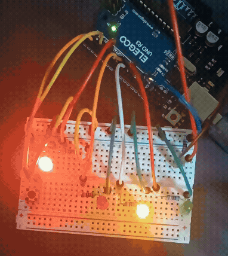

# 光量自動調整信号機（LED_07）

## 概要
フォトレジスタを用いて周囲の明るさを検知し、  
**明るい環境ではLEDの輝度を上げ、暗い環境では光量を抑える制御**を実装した。


LED_06で課題だった「変化の分かりにくさ」を解消するため、  
**しきい値によって明るさを一気に切り替える方式**を採用しています。

---

## デモ

### 光量自動調整（しきい値制御）


明るい環境 → LEDが最大発光    
暗い環境 → LEDがほぼ消灯  

---

### 歩行者ボタン


ボタン押下で信号状態が遷移  

---

## 改良ポイント（LED_06 → LED_07）

| 項目 | LED_06 | LED_07 |
|------|--------|--------|
| 光量変化 | 連続的で分かりにくい | しきい値で明確に変化 |
| 輝度制御 | 緩やか | 一気に切り替え |
| 視認性 | 低い | 高い |
| デモ性 | 弱い | 強い |

---

## 技術ポイント

### ① しきい値による輝度制御

光センサの値に対してしきい値を設定し、  
一定以上かどうかでLEDの明るさを切り替える方式を採用。

```cpp
if (lightValue > 300) {
  brightness = 255;    // 明るい → 最大発光
} else {
  brightness = 10;   // 暗い → ほぼ消灯
}
```

---

### ② 状態遷移（State Machine）
- 赤 / 緑 / 黄 の状態管理
- millis()による非同期制御
- ボタン入力と連動

---

### ③ 非同期処理（millis）
delayを使用せず、時間管理を行うことで  
センサ入力やボタン処理と並行動作を実現

---

## システム構成

- 入力：フォトレジスタ / ボタン  
- 制御：状態遷移 + 時間管理  
- 出力：LED（PWM制御）

---

## 実行方法
1. Arduino IDEを起動  
2. LED_07.ino を開く  
3. ボードを「Arduino Uno」に設定  
4. COMポートを選択  
5. 書き込み  

---

## ディレクトリ構成

```
LED_07/
├── LED_07.ino
├── README.md
└── images/
    ├── demo_light.gif
    └── demo_button.gif
```

---

## 改良の意図

LED_06では光量に応じた連続的な変化を実装していたが、  
視覚的に変化が分かりにくいという課題があった。

そのためLED_07では、しきい値を用いて  
**明るさを段階的ではなく瞬時に切り替える設計**とし、  
視認性を優先した改善を行った。

※本手法はデモ用途として有効であり、  
用途によっては連続的な制御との使い分けが可能である。

---

## 学習ポイント
- センサ入力と出力制御の統合
- 非同期処理（millis）
- 状態遷移設計
- 視認性を考慮した設計改善

---

## まとめ
本プロジェクトでは、単なる機能実装に加え、  
**「分かりやすさ」を重視した設計改善**を行った。

しきい値制御を導入することで、  
一目で動作が理解できるシステムへと発展させている。
