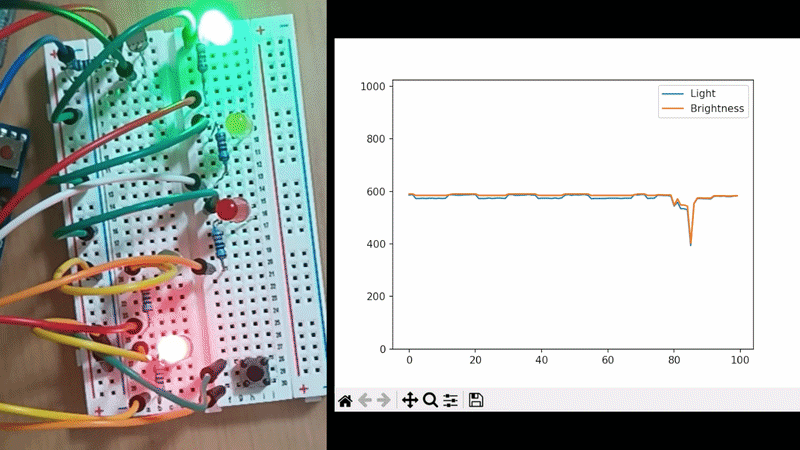
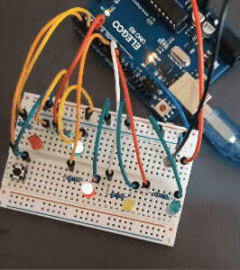

#  光量自動調整信号機（LED_08）

## 概要

フォトレジスタを用いて周囲の明るさを検知し、
**環境光に応じてLEDの輝度を自動調整する信号機システム**を開発しました。

さらに本バージョンでは、Arduino単体の制御に加え、
**Pythonと連携したリアルタイム可視化機能**を実装しています。

---

##  デモ

### リアルタイム可視化 + 光量制御



* 手でセンサを遮光 → LEDが暗くなる
* グラフがリアルタイムで追従
* 状態（RED/GREEN/YELLOW）と同期

---

### 歩行者ボタン


ボタン押下で信号状態が遷移  

---

##  特徴

*  環境光に応じたLED自動調整（連続変化）
*  Pythonによるリアルタイムグラフ表示
*  Arduino-Python間のシリアル通信
*  CSVログ保存（データ分析可能）
*  ノンブロッキング処理による高速描画

---

##  LED_07 → LED_08 の進化

| 項目    | LED_07       | LED_08           |
| ----- | ------------ | ---------------- |
| 光量制御  | しきい値（ON/OFF） | 連続変化（滑らか）        |
| 可視化   | なし           | リアルタイムグラフ        |
| データ記録 | なし           | CSV保存            |
| システム  | Arduino単体    | Arduino + Python |

---

##  技術ポイント

### ① 連続的な輝度制御

```cpp
brightness = brightness * 0.9 + targetBrightness * 0.1;
```

→ センサ値に応じて滑らかに変化（ローパスフィルタ）

---

### ② ノイズ対策

```cpp
for (int i = 0; i < 5; i++) {
  sum += analogRead(LIGHT_SENSOR);
}
```

→ 複数回サンプリングによる安定化

---

### ③ シリアル通信（Arduino → Python）

```cpp
Serial.print(now);
Serial.print(",");
Serial.print(lightValue);
Serial.print(",");
Serial.print(brightness);
```

→ センサ値・輝度・状態を送信

---

### ④ リアルタイム可視化（Python）

```python
ax.plot(light_data, label="Light")
ax.plot([b*4 for b in brightness_data], label="Brightness")
```

→ 光量と輝度を同時に表示

---

### ⑤ パフォーマンス最適化

* baudrate：115200
* ノンブロッキング通信
* データ数制限（軽量化）

---

##  システム構成

```text
[光センサ]
     ↓
 Arduino（明るさ制御）
     ↓（Serial通信）
 Python（可視化・記録）
     ↓
 グラフ表示 + CSV保存
```

---

##  使用技術

### ハードウェア

* Arduino Uno
* フォトレジスタ
* LED（信号機 + 歩行者）
* 抵抗 / ブレッドボード

---

### ソフトウェア

* Arduino IDE（C++）
* Python 3

---

### Pythonライブラリ

```bash
pip install pyserial matplotlib keyboard
```

---

## 実行方法

### ① Arduino

1. LED_08.ino を書き込み
2. シリアル通信開始（115200）

---

### ② Python

```bash
python LED_08.py
```

---

##  出力データ（CSV）

```text
time, light, brightness, state
1234, 500, 120, RED
```

---

##  ディレクトリ構成

```
LED_08/
├── LED_08.ino
├── LED_08.py
├── README.md
└── images/
    └── demo.gif
```

---

##  改良の意図

LED_07ではしきい値による段階的な変化を採用し、
視認性の向上を図った。

本バージョンではさらに発展させ、
**連続的な変化 + 可視化 + データ記録**を統合することで、
単なる制御から「システムとしての完成度」を高めた。

---

##  今後の改善

* 状態（RED/GREEN）の色分け表示
* GUI化（Tkinter / PyQt）
* Webアプリ化（Flask）
* IoT化（クラウド連携）

---

##  作者

GitHub: https://github.com/yuu403

---

##  まとめ

本プロジェクトでは、センサ制御に加えて
**リアルタイム可視化とデータ記録を統合**し、

「動きが分かる」だけでなく
**「仕組みまで理解できるシステム」**へと発展させた。

