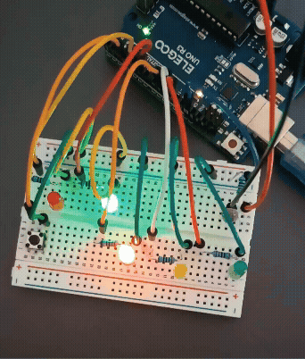
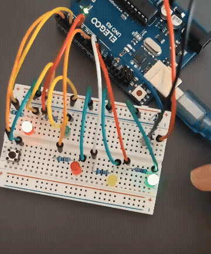
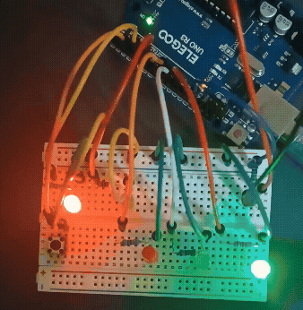

#  Arduino Portfolio

## 概要
Arduinoを用いた開発プロジェクトをまとめたポートフォリオです。  
**状態遷移・時間制御・センサ入力を組み合わせた組み込みシステムを設計・実装**し、
基礎から応用まで段階的にスキルを習得しました。

単純なLED制御から始め、最終的には**環境に応じて動作する自動制御システム**を構築しています。

---
##  メインプロジェクト：光量自動調整信号機

### LED_06 → LED_07 改良

#### LED_06（改善前）

- 光量に応じてLEDの明るさを連続的に変化
- 変化が緩やかで視覚的に分かりにくい

 詳細  
→ [LED_06を見る](./LED_06)

---

#### LED_07（改善後）

- しきい値による明るさ制御を導入
- 明るい / 暗いで**一気に切り替え**
- 一目で変化が分かる

 詳細  
→ [LED_07を見る](./LED_07)

#### 歩行者ボタン

**概要**

フォトレジスタを用いて周囲の明るさを検知し、
LEDの輝度を自動で調整する信号機システムを実装しました。

**技術ポイント**

- 状態遷移（State Machine）による制御設計
- millis() を用いた非同期処理（ノンブロッキング）
- フォトレジスタによるアナログ入力処理
- PWM制御によるLEDの明るさ調整（analogWrite）
- 環境変化に応じたリアルタイム制御

入力・状態・環境のすべてを統合したシステム
[詳細はこちら](./LED_06)

####  このプロジェクトでできること

- 基本的なLED制御
- ノンブロッキングな時間制御
- 入力イベント処理
- 状態遷移設計
- センサを用いた環境適応制御

 小さな回路から、環境に応じて動作するシステムまで構築可能

---
##  使用環境

- ELEGOO UNO R3（Arduino Uno互換機）
- Arduino IDE

---

## スキル
- Arduino（C/C++）
- 組み込みシステム設計
- 状態遷移設計（State Machine）
- 非同期処理（millis）
- センサ入力処理（アナログ）
- PWM制御

---

## 成果
- 複数状態（最大5状態）の信号機制御を実装
- 非ブロッキング処理により複数処理の同時実行を実現
- 入力（スイッチ）・出力（LED）・センサ（光）を統合したシステムを構築
- 環境光に応じたリアルタイム制御を実現

---

## 実行方法
- Arduino IDEをインストール
- 任意のプロジェクトフォルダ（例：LED_06）を開く
- ボードを「Arduino Uno」に設定
- COMポートを選択
- マイコンへ書き込み

---

##  作品一覧

| No | プロジェクト名 | 内容 | 主な技術 |
|----|--------------|------|----------|
| 1 | [LED点滅（基礎）](./LED_01) | delayを使った基本的なLED点滅 | digitalWrite / delay |
| 2 | [非同期LED制御](./LED_02) | millisを使った非ブロッキング処理 | millis / 時間管理 |
| 3 | [スイッチ連動LED制御](./LED_switch) | ボタンでLED制御＋状態管理 | INPUT_PULLUP / トグル制御 |
| 4 | [信号機制御](./LED_03) | 赤・黄・緑LEDで信号機を再現 | 状態遷移 / millis |
| 5 | [歩行者ボタン付き信号機](./LED_04) ⭐ | 入力＋状態遷移の統合制御 | イベント処理 / 設計力 |
| 6 | [歩行者信号](./LED_05) ⭐ | 車＋人の連動制御 | 状態設計 |
| 7 | [光量調整信号（旧）](./LED_06)  | センサ＋PWM制御 | 環境適応 |
| 8 | [光量調整信号（改良）](./LED_07) ⭐⭐ | 改善設計 | 視認性 |

---

##  設計の流れ
1. 出力制御（LED）
2. 時間制御（delay → millis）
3. 入力処理（スイッチ）
4. 状態遷移設計
5. イベント制御
6. 複合システム（歩行者信号）
7. 環境適応（光量制御）
8. 視認性を考慮した改善（LED_07）

---

##  ディレクトリ構成
arduino_project1/
│
├── LED_01/
│ ├── LED_01.ino
│ └── README.md
│
├── LED_02/
│ ├── LED_02.ino
│ └── README.md
│
├── LED_switch/
│ ├── LED_switch.ino
│ └── README.md
│
├── LED_03/
│ ├── LED_03.ino
│ └── README.md
│
├── LED_04/
│ ├── LED_04.ino
│ └── README.md
│
├── LED_05/
│ ├── LED_05.ino
│ └── README.md
│
├── LED_06/
│ ├── LED_06.ino
│ └── README.md
│
├── LED_07/
│ ├── LED_07.ino
│ └── README.md
│
└── README.md

##  補足
本ポートフォリオは、組み込み開発の基礎から設計力の習得を目的として作成した。  
ELEGOO UNO R3を使用し、Arduino Uno互換環境で動作確認を行っている。
